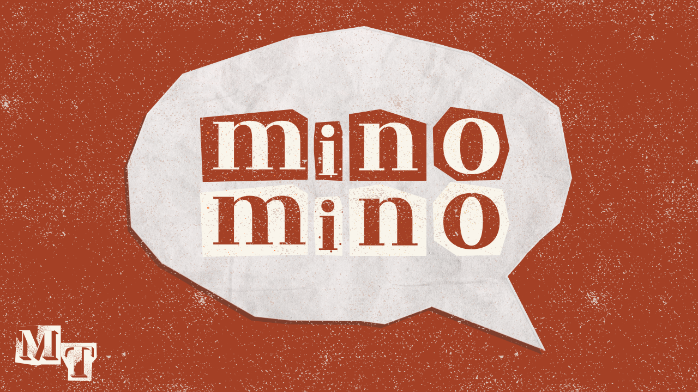

# 
## < Link esterni >

### Storico delle revisioni del documento
| Versione |  Autori  |   Data   |   Note   |
| :------: | :------: | :------: | :------: |
| 1.00     | Francesca Palumbo | 03/07/2025 | Prima versione della GDD |
|   ...    |   ...    |   ...    |   ...    |

### Descrizione del progetto (elevator pitch)
Questo documento di game design descrive i dettagli di **minomino** è un gioco per PC a turni ispirato alla mitologia greca, con un'estetica teatrale e un'anima multiplayer locale. Progettato per un target **casual e famigliare**, combina strategia leggera e storytelling creativo.  
  
L'idea include una **campagna per sbloccare nuovi personaggi giocabili** e una modalità multiplayer locale veloce e divertente per sfidare amici e parenti. L’avventura prende vita su un piccolo palco, dove due maestri burattinai, danno forma a eroi e mostri della mitologia greca dimostrando ai propri nipoti chel’immaginazione non ha confini.  

Il sipario si apre su scenari ispirati al mito: ogni combattimento è una rappresentazione teatrale. In ogni sfida, il giocatore veste i panni di un personaggio mitologico –come Teseooil Minotauro, protagonisti della demo –per rivivere antiche rivalità... ma in chiave pop e colorata!  

minomino è un gioco a turni strategico: non ci sono combo o riflessi istantanei, ma scelte tattiche con effetti immediati. Ogni personaggio ha tre azioni: attacco, difesa e una mossa bonus per vincere pacificamente accumulando tre "sfere teatrali".  

I turni sono scanditi da 5 secondi e dal jingle “mino, mino, tauro!”, al termine del quale entrambi i giocatori devono aver scelto la loro mossa. Vince chi porta l'avversario a zero punti vita ochi ottiene per primo i tre punti bonus.  

La progressione è lineare, con sblocco graduale di 6 coppie iconiche mitologiche (12 personaggi) e una fase finale di customizzazione, che permette di creare il proprio burattino combinando volti, mosse e stili preferiti.  

Lo stile è fortemente ispirato ai diari illustratie al cartoon low-poly, con texture dipinte a mano e contorni spessi. I burattini hanno animazioni “stop-motion-like” e un’illuminazione soft da palcoscenico, per enfatizzare l’atmosfera teatrale. Mockupe sketch mostrano le quinte, le tende e le icone delle mosse con un design semplice ma distintivo, perfetto per creare un’identità visiva riconoscibile.  

Sarà sviluppato in Godot(v. 4.4.1)efrutto del lavoro di due sviluppatoriche cureranno insieme game design, sviluppo, animazione e UX/UI.
La produzione seguirà un approccio agile, con sprint settimanalie milestone chiave: prototipo, meccaniche, interfaccia, campagna e polishfinale.
Per la modalità single player, l’IA è governata da uno script pseudo-strategico, con possibili evoluzioni in pattern adattiviper una sfida sempre più dinamica.

### Il minoteam
   

## Indice  
- [Personaggi](#personaggi)  
- [Storia](#storia)  
  - [Tema](#tema)  
- [Trama](#trama)  
- [Gameplay](#gameplay)  
  - [Obiettivi](#obiettivi)  
  - [Abilità del giocatore](#abilit%C3%A0-del-giocatore)  
  - [Meccaniche di gioco](#meccaniche-di-gioco)  
  - [Oggetti e power-ups](#oggetti-e-power-ups)  
  - [Progressione e sfida](#progressione-e-sfida)  
  - [Sconfitta](#sconfitta)  
- [Art Style](#art-style)  
- [Musica e suono](#musica-e-suono)  
- [Dettagli tecnici](#dettagli-tecnici)  
- [Mercato](#mercato)  
  - [Target](#target)  
  - [Piattaforma e monetizzazione](#piattaforma-e-monetizzazione)  
  - [Localizzazione](#localizzazione)  
- [Idee](#idee)  

**Questo indice non è definitivo, ma può essere modificato in base alla tipologia di gioco o alle necessità. L’importante è che il documento riporti tutti i dettagli relativi al game design del gioco che si intende sviluppare.**

## Personaggi
**minomino** presenta un cast di personaggi ispirati alla mitologia greca, reinterpretati in chiave pop e teatrale. Ogni personaggio viene rappresentato come un burattino di carta con un design distintivo e uno stile narrativo coerente con la propria leggenda.

I personaggi si sbloccano gradualmente e sono organizzati in coppie mitologiche rivali, i primi due giocabili nella demo sono:

-  Teseo – L'eroe determinato ed abile stratega.
-  Minotauro – Il “mostro” incompreso, forte ma dotato di grande immaginazione, ignaro del diverso, danza per istinto, attacca per sopravvivenza.

Tra gli altri personaggi sbloccabili nel gioco completo:  
-  Perseo – Astuto semidio che con l'ingegno riesce sempre a tirarsi fuori dai guai.
-  Medusa – Unica mortale tra le sue sorelle Gorgoni, trasforma in pietra chiunque le guardi.
-  Ulisse – Avventuroso re di Itaca, con furbizia si destreggia tra le più temerarie difficoltà.
-  Polifemo – Gigante con un occhio solo. Se diffidente, divora senza pietà chi non conosce.

Ogni burattino ha una personalità distinta che emerge nelle animazioni e nelle azioni che può svolgere in partita.

## Storia
Due anziani burattinai mettono in scena spettacoli per i loro giovani nipoti. Per affascinarli, danno vita a rappresentazioni mitologiche reinterpretate con colori accesi, musica coinvolgente e battute leggere. Ogni sfida è un piccolo atto teatrale che racconta, con ironia e stupore, le antiche rivalità della mitologia greca.

Il palco, con le sue quinte, corde e riflettori, diventa un mondo immaginario in cui la fantasia prende il sopravvento sulla realtà. Ogni match rappresenta un nuovo "spettacolo".

### Tema
Il tema principale è la forza dell'immaginazione: la mitologia greca come patrimonio creativo che può essere reinterpretato per ispirare nuove generazioni.

Il gioco promuove inoltre il valore della narrazione condivisa, della collaborazione familiare e del gioco leggero ma significativo.

## Trama
Il giocatore segue gli spettacoli teatrali messi in scena dai due burattinai. Ogni "atto" della campagna corrisponde a una rivalità mitologica, e vincere gli scontri consente di sbloccare nuovi personaggi, nuovi atti e contenuti estetici.

La progressione culmina in una fase finale in cui il giocatore crea il proprio burattino personalizzato, mescolando elementi sbloccati durante il gioco.

## Gameplay
Minomino è un gioco a turni strategico, diviso in round da tre turni, al meglio di 3 o di 5. Il giocatore sceglie, entro 5 secondi, se preferisce difendere o migliorare l'attacco con oggetti consumabili, al quinto secondo deve scegliere a ritmo una delle tre mosse disponibili:
- Attacco
- Difesa
- Mossa bonus
Un jingle scandisce il ritmo dei turni: "mino, mino, tauro!". Entrambi i giocatori scelgono simultaneamente.

### Obiettivi
In base al tipo di personaggio scelto potrebbero esserci obiettivi diversi. In particolare:
- Vincere lo scontro abbattendo i punti vita dell'avversario
- Usare tre volte la mossa bonus con Teseo per vincere lo scontro pacificamente.
- Sbloccare nuovi personaggi e completare la campagna
- Personalizzare il proprio burattino finale

### Abilità del giocatore
Il giocatore deve sviluppare capacità decisionali rapide, lettura delle intenzioni dell'avversario, gestione del rischio e comprensione delle peculiarità di ogni personaggio.

Non sono richiesti riflessi pronti: la sfida è tutta mentale e ritmica.

### Meccaniche di gioco
- Turni simultanei a tempo (5 secondi per scegliere)
- Sistema "triade": ogni personaggio ha due mosse base e una bonus
- Mosse con effetti immediati e leggibili
- L'accumulo di tre mosse bonus per Teseo come meccanica alternativa di vittoria
- L'accumulo di due mosse bonus per il Minotauro come meccanica per aumentare il danno dell'attacco
- Modalità campagna con sblocco progressivo
- Multiplayer locale competitivo

### Oggetti e power-ups
Successivamente alla scelta del personaggio da schierare sul palcoscenico, il player potrà scegliere uno tra due (per il momento) **Starter Kit** contenenti tre oggetti volti al miglioramento di statistiche quali la barra della salute, l'attacco, la difesa e altri. Nello specifico:
- **Safety Pack**:
  - [Nome item] : Cura 5HP
  - [Nome item] : Cura 10HP
  - [Nome item] : Previene tutti i danni del prossimo turno
- **Rage pack**:
  - [Nome item]: L'attacco ha un boost di 3
  - [Nome item]: Se vieni attaccato mentre attacchi, recupera 2HP
  - [Nome item]: L'attacco sfugge alle difese dell'avversario

### Progressione e sfida
La campagna è lineare, suddivisa in 6 atti mitologici (ciascuno con una coppia di personaggi). Superati gli atti, si sblocca la modalità custom.

### Sconfitta
Il giocatore perde se:
- I propri punti vita arrivano a zero
- Teseo raccoglie usa tre mosse bonus con successo

## Art Style
- Stile illustrato: texture disegnate a mano, contorni spessi
- Animazioni "stop-motion-like"
- Illuminazione da palcoscenico con tende e luci che mostrino chiaramente l'azione.

## Musica e Suono
- Jingle ritmico per scandire i turni (es. "mino, mino, tauro!")
- Musica di sottofondo ispirata alla mitologia ma reinterpretata in chiave leggera (archi pizzicati, percussioni giocose)
- Effetti sonori teatrali (applausi, dissensi dal pubblico, etc.)

## Dettagli Tecnici
- Piattaforma: PC (con estendibilità a Steam Deck, console indie-friendly)
- Motore: Godot Engine v. 4.4.1
- Produzione agile con sprint settimanali
- IA: script pseudo-strategico con evoluzione adattiva

Qui vanno inseriti i dettagli tecnici relativi alle piattaforme per le quali verrà sviluppato il gioco e dettagli sui tool che verranno utilizzati. Questa sezione non dovrebbe essere molto dettagliata, ma dovrebbe fornire solo le informazioni più importanti. I dettagli vanno inseriti in un documento separato (Technical Design Document – TDD, non è richiesto per l'esame). Se decidete di utilizzare algoritmi particolari, ad esempio di generazione procedurale dei contenuti, elencate qui le metodologie che intendete utilizzare.

## Mercato
**minomino** si rivolge a un pubblico casual, familiare e a giocatori sociali in cerca di esperienze accessibili e originali.

Il mercato dei party game e giochi turn-based "leggeri" è in crescita, soprattutto su piattaforme come Steam, itch.io e Nintendo Switch. Il gioco ha potenziale sia per il mercato europeo che per il Nord America.

Finanziamento tramite:
- Fondi per la creatività digitale
- Programmi indie
- Eventuale crowdfunding
### Target  
- Età: 8+ anni
- Giocatori casual, famiglie, educatori, creativi
- Persone attratte da narrazione leggera e stile grafico distintivo

Il gioco offre un'alternativa alle esperienze frenetiche, proponendo un ritmo rilassato ma coinvolgente, con forte appeal estetico e una componente cooperativa/comunitaria.

Descrivere il target/pubblico di riferimento. Cercate di descrivere il vostro giocatore “tipo” e quali aspettative ha. Come il vostro gioco soddisfa le aspettative del vostro target?
### Piattaforma e monetizzazione
- PC (Steam) – versione base a pagamento con contenuti completi
- Valutazione di console (Switch, Xbox Indie Program)
- Monetizzazione tramite versione full, con eventuali DLC estetici

### Localizzazione
Lingue previste:
- Italiano (lingua principale)
- Inglese
- Francese
- Tedesco
- Spagnolo
Possibile estensione a giapponese per pubblico amante dell'estetica pop/cartoon.

## Idee
- Implementazione di una modalità cooperativa asincrona, in cui più giocatori raccontano una storia teatrale a turni
- Modalità "crea il tuo atto" per generare match personalizzati
- Integrazione di un diorama editor per personalizzare lo sfondo del palco
