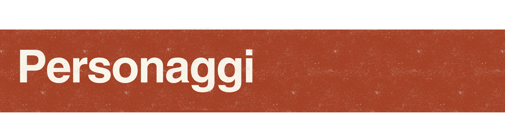
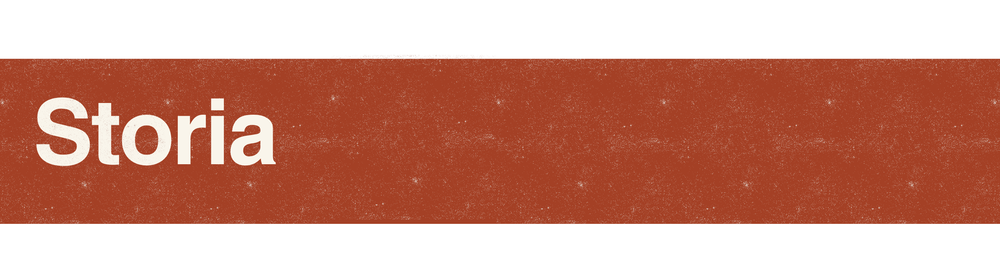
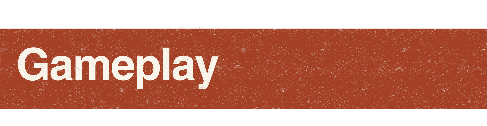
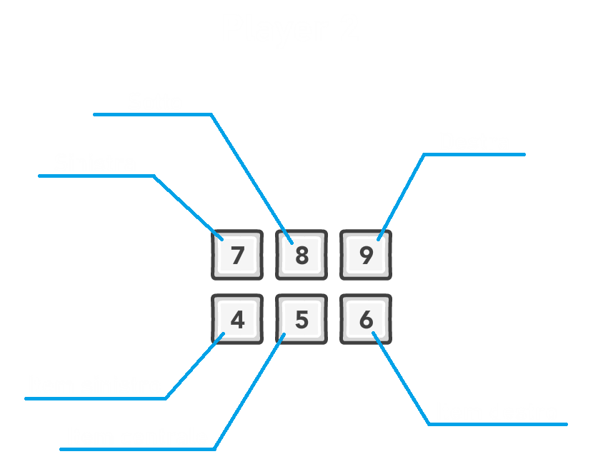
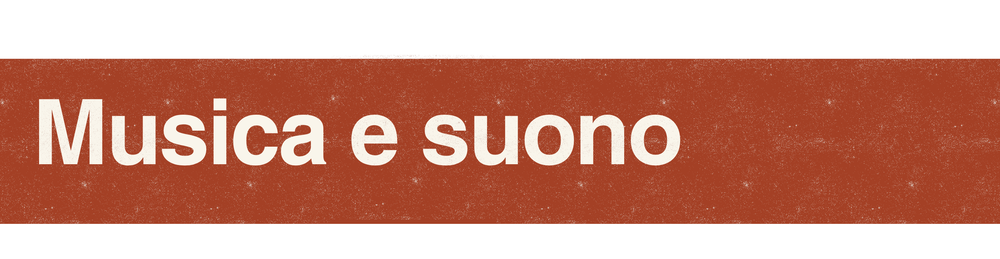
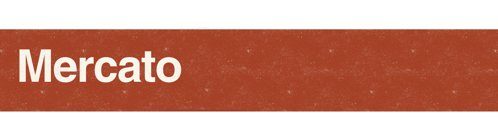

### Storico delle revisioni del documento
| Versione |             Autori             |    Data    |                                                   Note                                                    |
| :------: | :----------------------------: | :--------: | :-------------------------------------------------------------------------------------------------------: |
|   1.00   |       Francesca Palumbo        | 03/07/2025 |                                         Prima versione della GDD                                          |
|   2.00   | Yuri Tateo e Francesca Palumbo | 10/07/2025 | Seconda versione della GDD a demo completata, con ampliamento di tutti i campi rispetto la prima versione |
|   3.00   | Yuri Tateo e Francesca Palumbo | 11/07/2025 | Aggiunta delle immaginidi gioco, dell'artstyle, concept art e comandi di gioco, ulteriori dettagli finali |

### Descrizione del progetto ([elevator pitch](PitchMinoMino.pdf))
Questo documento di game design descrive i dettagli di **minomino**: un gioco a turni ispirato alla mitologia greca, con un'estetica teatrale e un'anima multiplayer locale. Progettato per un target **casual e famigliare**, combina strategia leggera e storytelling creativo.  
  
L'idea include una **campagna per sbloccare nuovi personaggi giocabili** e una modalità multiplayer locale veloce e divertente per sfidare amici e parenti. L’avventura prende vita su un piccolo teatro di legno, dove una coppia di nonni, dà forma a eroi della mitologia greca dimostrando ai propri nipoti che l’immaginazione non ha confini.  

Il sipario si apre su scenari ispirati al mito: ogni combattimento è una rappresentazione teatrale. In ogni sfida, il player veste i panni di un personaggio mitologico – come Teseo o il Minotauro, protagonisti della demo –per rivivere antiche rivalità... ma in chiave pop e colorata!  

**minomino** è un gioco dove non ci sono combo o riflessi istantanei, ma scelte tattiche con effetti immediati. Ogni personaggio ha tre azioni: attacco, difesa e una mossa bonus personalizzata per ciascun personaggio in base al proprio playstyle, mossa che generalmente opera con i cosiddetti "punti bonus".

I turni sono scanditi da 5 secondi e dal jingle “mino, mino, tauro!”, al termine del quale entrambi i giocatori devono aver scelto la loro mossa con il giusto tempismo. Vince chi porta l'avversario a zero punti vita o chi ottiene per primo, se esiste, il proprio obiettivo secondario.  

La progressione è lineare, con sblocco graduale di 6 coppie iconiche mitologiche (12 personaggi) e una fase finale di customizzazione, che permette di creare il proprio burattino combinando volti, mosse e stili preferiti.  

L'art-style è fortemente ispirato ai diari illustrati e al cartoon low-poly, con texture dipinte a mano e contorni spessi. I burattini hanno animazioni “stop-motion-like” e un’illuminazione da palcoscenico, per enfatizzare l’atmosfera teatrale. Mockup e sketch mostrano le quinte, le tende e le icone delle mosse con un design semplice ma distintivo, perfetto per creare un’identità visiva riconoscibile.  

Sarà sviluppato in Godot (v. 4.3-stable) e frutto del lavoro di due sviluppatori che cureranno insieme game design, sviluppo, animazione e UX/UI. La produzione seguirà un approccio agile, con sprint settimanali e milestone chiave: prototipo, meccaniche, interfaccia, campagna e polish finale. Per la modalità single player, l’IA sarà governata da uno script pseudo-strategico, con possibili evoluzioni in pattern adattivi per una sfida sempre più dinamica.

### L'MT: il MinoTeam
   

## Indice  
- [Personaggi](#personaggi)  
- [Storia](#storia)  
  - [Tema](#tema)  
- [Trama](#trama)  
- [Gameplay](#gameplay)  
  - [Obiettivi](#obiettivi)  
  - [Abilità del giocatore](#abilit%C3%A0-del-giocatore)  
  - [Meccaniche di gioco](#meccaniche-di-gioco)  
  - [Oggetti e power-ups](#oggetti-e-power-ups)  
  - [Progressione e sfida](#progressione-e-sfida)  
  - [Sconfitta](#sconfitta)  
- [Art Style](#art-style)  
- [Musica e suono](#musica-e-suono)  
- [Dettagli tecnici](#dettagli-tecnici)  
- [Mercato](#mercato)  
  - [Target](#target)  
  - [Piattaforma e monetizzazione](#piattaforma-e-monetizzazione)  
  - [Localizzazione](#localizzazione)  
- [Idee](#idee)

  
## Personaggi
**minomino** presenta un cast di personaggi ispirati alla mitologia greca, reinterpretati in chiave pop e teatrale. Ogni personaggio viene rappresentato come un burattino di carta con un design distintivo e uno stile narrativo coerente con la propria leggenda.

I personaggi si sbloccano gradualmente e sono organizzati in coppie mitologiche rivali, i primi due giocabili nella demo sono:

- Teseo – L'eroe determinato ed abile stratega.
- Minotauro – Il “mostro” incompreso, forte ma dotato di grande immaginazione, ignaro del diverso, danza per istinto, attacca per sopravvivenza.

   

Tra gli altri personaggi sbloccabili nel gioco completo:  
- Perseo – Astuto semidio che con l'ingegno riesce sempre a tirarsi fuori dai guai.
- Medusa – Unica mortale tra le sue sorelle Gorgoni, trasforma in pietra chiunque le guardi.
- Ulisse – Avventuroso re di Itaca, con furbizia si destreggia tra le più temerarie difficoltà.
- Polifemo – Gigante con un occhio solo. Se diffidente, divora senza pietà chi non conosce.

 
 

Ogni personaggio ha una personalità distinta che emerge nelle animazioni e nelle azioni che può svolgere in partita. I personaggi dispongono di mosse speciali ad hoc e statistiche che rispecchiano la loro personalità.

| Personaggio | Attacco | Difesa | HP  | Mossa Speciale                     |
| ----------- | ------- | ------ | --- | ---------------------------------- |
| Teseo       | + 10    | + 10   | 50  | Filo d'Arianna (vittoria pacifica) |
| Minotauro   | + 10    | + 10   | 50  | Doppio Attacco (50% in più)        |

Per la demo le statistiche dei due personaggi sono uguali per semplicità di gameplay, nel gioco completo saranno diversificate per garantire profondità del gameplay e varietà nei personaggi.  

  
## Storia
[Cutscene Iniziale](https://youtu.be/Zpo7WcD7IP4)  
Una bambina, ormai diventata adulta, riporta alla mente i ricordi della sua estate 2006. Ha trascorso le vacanze estive con suo fratello a casa dei nonni con i quali avevano un bellissimo rapporto. Tra le attività che amavano fare insieme per trascorrere le calde giornate, la preferita era quella di disegnare insieme e di dare vita a storie e personaggi di cui immaginavano le sembianze, i colori e le narrazioni.

In un pomeriggio non poi diverso dagli altri, l'allora bambina mostrò ai suoi nonni l'ultimo disegno realizzato con il fratello: Teseo e il Minotauro.

   

L'anziana coppia, affascinata dall'amore dei bambini per l'immaginazione e l'emozione per l'avventura, decisero di dar vita a rappresentazioni mitologiche mediante un teatrino di legno e burattini di carta dai colori accesi.

I quattro passarono le settimane successive a mimare le azioni dei personaggi, ricreare un motivetto coinvolgente e intavolare battute leggere. Ogni sfida è un piccolo atto teatrale che racconta, con ironia e stupore, le antiche rivalità della mitologia greca.

Il palco, con le sue quinte, corde e riflettori, diventa un mondo immaginario in cui la fantasia prende il sopravvento sulla realtà. Ogni scontro rappresenta un nuovo "spettacolo".
### Tema
Tema di **minomino** è la forza dell'immaginazione: la mitologia greca come patrimonio creativo che può reinventarsi ispirando anche le nuove generazioni.

Inoltre, la narrazione condivisa, la collaborazione familiare e il gioco leggero ma significativo sono altri degli aspetti con cui i giocatori si interfacciano durante l'esperienza di gioco.
## Trama
- Modalità Single Player:
  Il player "segue" gli spettacoli teatrali messi in scena.
  Ogni "atto" della campagna corrisponde a una rivalità mitologica, dove sarà necessario vincere la sfida da entrambi i punti di vista e per sbloccare nuovi personaggi (che possono essere riutilizzati nella modalità libera e nella modalità multiplayer locale), nuovi atti.
  
  Le sfide tra eroi (perché non ci sono buoni e cattivi, ma gesta eroiche) rispecchiano ogni mito nel design dei personaggi, dell'ambientazioni e degli asset di mosse assegnati.
  
  _(p.e. Perseo vs Medusa, dove Perseo può sfruttare lo specchio per pietrificare Medusa e quest'ultima può invece pietrificarlo mentre lui è indifeso)_
  
  La progressione culmina in una fase finale in cui il player potrà creare il proprio eroe personalizzato, mescolando elementi estetici sbloccati durante il gioco, riutilizzandolo sia nelle altre modalità che in una modalità multiplayer online come avatar (vedi [Idee](#idee) )

  
## Gameplay
**minomino** è un gioco a turni strategico, costituito da match al meglio di 5 da cinque turni ciascuno.
Durante ogni turno, al player è affidata la gestione di 5 secondi, per cui:
- **ENTRO 5 SECONDI**:
  Il player dovrà scegliere se assegnare un item del Kit scelto in precedenza per il suo eroe (vedi [Oggetti e power-ups](#oggetti-e-power-ups))
- **ALLO SCADERE DEL QUINTO SECONDO
  (espediente ritmico scandito da "mino" "mino" "tauro!")**:
  Il player dovrà scegliere la sua mossa per il turno tra tre azioni disponibili:
	- Attacco
	- Difesa
	- Mossa bonus*
\*_Ogni eroe giocabile ha una mossa bonus su misura che gli permette di movimentare il match (p.e. il Minotauro può caricare (primo utilizzo della mossa bonus) e sferrare (secondo utilizzo) un attacco più forte utilizzando due volte la mossa bonus. Teseo, invece, scegliendo e usando con successo per tre volte la sua mossa bonus, riavvolgendo il filo d'Arianna, vince la partita pacificamente_.

Un jingle visivo (non musicale per il momento, vedi [Idee](#idee)) scandisce il ritmo dei turni: "mino", "mino", "tauro!". Entrambi i giocatori scelgono in contemporanea la loro azione. Il player non può scegliere per due volte consecutive la stessa.  

  

Nel caso in cui si dovesse scegliere troppo presto o troppo tardi l'azione per il proprio eroe, quest'ultima subirà una penalità lieve. Per il nostro gioco, una mossa è considerata a ritmo se il player la sceglie entro 0.2 secondi dallo scadere del quinto secondo. Sceglierla poco prima o poco dopo questa finestra di input risulterà in una penalità lieve, mentre sceglierla 

Le azioni svolte dai due eroi sono percepibili tramite:
- brevi animazioni (per l'attacco),
- feedback sonori
e sono visionabili (per il momento, vedi [Idee](#idee)) grazie a due finestre testuali posizionate agli angoli in alto della schermata di gioco.

#### Comandi
Per rendere la demo quanto più accessibile possibile per gli utenti, è stata implementata la compatibilità con tutti i controller delle console principali. Riportiamo quindi il layout dei comandi per *DualShock 4/5*, *Xbox Controller* e *Nintendo Switch Pro Controller*.

|                       DualShock                        |                     Xbox/Switch Pro Controller                      |
| :----------------------------------------------------: | :-----------------------------------------------------------------: |
|  |  |

Per estendere l'opportunità di giocare la demo a quanti più utenti possibili, è stato implementato ad hoc per la demo un sistema di input da tastiera, che copre anche il multiplayer locale su un'unica tastiera. Di seguito riportiamo le immagini con i comandi per entrambi i player.

|                 Giocatore 1 - Tastiera regolare                 |                Giocatore 2 - Tastierino numerico                |
| :-------------------------------------------------------------: | :-------------------------------------------------------------: |
|  |  |

Le immagini dei controller e dei tasti della tastiera sono state messe a disposizione dall'utente [Nicolae (Xelu) Berbece](https://www.reddit.com/r/gamedev/comments/1z0zid/free_keyboard_and_controllers_prompts_pack/), sotto la licenza *Creative Commons 0 (CC0)*.

### Obiettivi
- Obiettivi del gioco in modalità Single Player (Campagna)
	- Vincere gli scontri e superare gli "atti"
	- Sbloccare nuovi personaggi per completare la campagna
	- Personalizzare il proprio burattino finale
- Modalità Multiplayer Locale/ Modalità libera/ Modalità Single Player
	- Obiettivi per ogni scontro:
		- Vincere tre match
	- Obiettivi per ogni match:
	  In base al tipo di eroe scelto potrebbero esserci obiettivi diversi. In particolare:
		- Vincere il match abbattendo i punti vita dell'avversario (applicabile a tutti gli eroi)
		- Usare tre volte la mossa bonus con Teseo per vincere il match pacificamente.
	- Obiettivi per ogni turno:
		- Scegliere un eventuale item dal Kit
		- Scegliere l'azione per il turno andando a tempo
_Altri eroi potrebbero avere obiettivi secondari così come per Teseo_
### Abilità del giocatore
Il giocatore deve sviluppare capacità decisionali rapide, lettura delle intenzioni dell'avversario, gestione del rischio e comprensione delle peculiarità di ogni personaggio.

Non sono richiesti riflessi pronti: la sfida è tutta mentale e ritmica.
### Meccaniche di gioco
- Turni simultanei a tempo per scegliere item e usare azione con penalità nel caso in cui non sia rispettato il ritmo.
- Sistema "triade":
  ogni eroe ha due mosse base e una bonus
	- L'accumulo di tre mosse bonus per Teseo come meccanica alternativa di vittoria
	- L'accumulo di due mosse bonus per il Minotauro come meccanica per aumentare il danno dell'attacco
- Sistema "StarterKit":
  ogni eroe ha un kit composto da tre item utilizzabili in uno scontro e ricaricati al termine di ogni match.
### Oggetti e power-ups
Successivamente alla scelta del personaggio da schierare sul palcoscenico, il player potrà scegliere uno tra due (per il momento, vedi [Idee](#idee)) **Starter Kit** contenenti tre oggetti volti al miglioramento di statistiche quali la barra della salute, l'attacco, la difesa e altri.

Nello specifico:
- **Safety Pack**:
  - Pot of Courage: Cura 5HP
  - Igea's Infusion: Cura 10HP
  - Divine Curtain: Previene tutti i danni del prossimo turno
- **Rage pack**:
  - Ares' Wrath: L'attacco ha un boost di 3
  - Fearless Heart: Se vieni attaccato mentre attacchi, recupera 2HP
  - Phantom Blade: L'attacco ignora le difese dell'avversario  
 

*(N.B. in quanto Divine Curtain e Phantom Sword si oppongono direttamente come effetti, i due item si annullano a vicenda se vengono utilizzati da due player diversi nello stesso turno.)*
### Progressione e sfida
La progressione della Modalità Single Player (campagna) è lineare e suddivisa in 6 "atti" (ciascuno caratterizzato da una coppia di eroi). Al superamento di ogni "atto" la difficoltà degli scontri aumenterà grazie ad un sistema di gestione della CPU implementata in seguito (vedi [Idee](#idee)).

Il primo atto, nello specifico, Teseo contro il Minotauro, l'obiettivo del player è proprio quello di familiarizzare con le meccaniche di gioco affinché si crei continuità con la sua esperienza in game.

Superati tutti gli atti, in seguito a ripetuti scontri con gli eroi che contraddistinguono il mito inscenato, oltre alla possibilità di sbloccare l'utilizzo dei singoli eroi in altre modalità di gioco (Modalità Libera e Modalità Multiplayer Locale), sarà possibile personalizzare un proprio burattino di carta non solo nelle fattezze estetiche, ma anche dal punto di vista delle abilità speciali e mosse.
### Sconfitta
Il player si considera sconfitto in un match se:
- I propri punti vita arrivano a zero
- L'eroe avversario raggiunge il suo obiettivo secondario
  _(p.e. Teseo usa tre volte la mossa bonus)
- Se ha meno HP dell'avversario
Il player si considera sconfitto in uno scontro se:
- Ha perso tre match

Nel caso in cui i player scendano sotto il 50% della vita del loro personaggio, alla fine del match gli HP del personaggio verranno riportati al 50%. Questo è per impedire che un player che perde troppa vita in un match non abbia più possibilità di recuperare nei match successivi.  

  
## Art Style
- Stile illustrato: texture disegnate a mano, contorni spessi
- Animazioni "stop-motion-like"
- Illuminazione da palcoscenico con tende e luci che mostrino chiaramente l'azione.  
    

  
## Musica e Suono
- Jingle ritmico per scandire i turni (es. "mino, mino, tauro!")
  _(Non implementato nella demo)_
- Tema musicale delle schermate: menu, scelta dei personaggi, scelta del kit.
  [MainTheme](./audio/MainTheme.mp3)
- Tema musicale per gli scontri
  [MainTheme](./audio/BattleTheme.mp3)
- Effetti sonori per utilizzo degli item, attacco, difesa e mossa speciale, oltre a un jingle per la schermata che annuncia il vincitore della partita.
  _(N.B. Per evitare confusioni durante i turni, dal momento che sono istantanei, viene riprodotto un solo sound effect per ogni turno, di conseguenza è stata definita una gerarchia di priorità per la loro riproduzione: Item -> Speciali -> Difesa -> Attacco)_

  
## Dettagli Tecnici
Le piattaforme prioritarie nell'implementazione sono:
- PC, Steam 
  _N.B. Al fine della demo sono stati implementati i controlli sia da controller che da tastiera così che si possa giocare in due anche su un solo dispositivo.
  (screenshot comandi)
- Console Indie-Friendly
- Mobile (Android & IOS)
  _N.B. Nel caso multiplayer locale, i giocatori dovranno disporre o di due controller da collegare al device, o avere due dispositivi diversi.
- Motore: Godot Engine v. 4.4.1
- Produzione agile con sprint settimanali
- IA: script pseudo-strategico con evoluzione adattiva
  _Non implementato nella demo_

  
## Mercato
**minomino** si rivolge a un pubblico casual, familiare e a giocatori sociali in cerca di esperienze accessibili e originali.

Il mercato dei party game e giochi turn-based "leggeri" è in crescita, soprattutto su piattaforme come Steam, itch.io e Mobile. Il gioco ha potenziale sia per il mercato europeo che per il Nord America.

Finanziamento tramite:
- Fondi per la creatività digitale
- Programmi indie
- Eventuale crowdfunding
- Incubatori di startup per l'industria videoludica
### Target  
- Età: 8+ anni
- Giocatori casual, famiglie, educatori, creativi
- Persone attratte da narrazione leggera e stile grafico distintivo

Il gioco offre un'alternativa alle esperienze frenetiche, proponendo un ritmo rilassato ma coinvolgente, con forte appeal estetico e una componente cooperativa/comunitaria.

Descrivere il target/pubblico di riferimento. Cercate di descrivere il vostro giocatore “tipo” e quali aspettative ha. Come il vostro gioco soddisfa le aspettative del vostro target?
### Piattaforma e monetizzazione
- PC (Steam) – versione base a pagamento con contenuti completi
- Valutazione di console (Switch, Xbox Indie Program)
- Monetizzazione tramite:
	- DLC estetici e con ulteriori eroi (basati su altre mitologie),
	- organizzazione di eventi competitivi e tornei con quote di partecipazione e ricompense per i vincitori, al fine di migliorare l'engagement e il feeling con il gioco da parte della community.
	- Attività di social branding:
		- Creazione di account social (p.e. Twitch, Instagram, Reddit, X)
		- Contenuti per i social in partnership con personaggi influenti delle communities videoludiche (p.e. Content Creators, Influencers)
		- Contenuti per sponsorizzazione

### Localizzazione
La lingua di gioco utilizzata è l'inglese, si prevede l'inserimento successivo delle seguenti:
- Italiano 
- Cinese (semplificato)
- Spagnolo
- Tedesco
Possibile estensione a giapponese per pubblico amante dell'estetica pop/cartoon.

  
## Idee
Idee modalità di gioco future:
- Modalità Multiplayer Online:
  Il player dopo aver finito la campagna e datagli la possibilità di customizzare il suo eroe, scende in battaglia nelle stesse modalità del multiplayer locale ma contro giocatori online.
- Modalità Infinita:
	- Multiplayer Online:
	  Il player disporrà di un eroe "vuoto" senza mossa bonus con uno StarterKit base, giocherà scontri contro altri giocatori online al termine di ognuno, in caso di vittoria potrà aprire dei "bauli" che conterranno dei potenziamenti (p.e. nuove mosse, mosse bonus speciali, item singoli o nuovi kit). In caso di sconfitta, il player dovrà ricominciare.
	- Single Player Locale:
	  Esattamente come nella modalità descritta al punto precedente, il player giocherà scontri contro burattini governati dall'AI.
- Modalità "crea il tuo atto" per generare match personalizzati

Integrazione di:
- Diorama editor per personalizzare lo sfondo del palco e utilizzarlo in Modalità Libera e Modalità Multiplayer Locale.
- Hero editor per creare e personalizzare il proprio burattino, mescolando elementi estetici e di gameplay sbloccati durante il gioco, riutilizzandolo sia nelle altre modalità che in una modalità online come avatar
- Jingle musicale che scandisce il ritmo dei turni: "mino", "mino", "tauro!".
  _Non implementato nella demo, cut-content._

Eliminazione dei Log dei giocatori nella Modalità Multiplayer Locale in ottica di migliorie all'esperienza di gioco tramite UX/UI, feedback sonori e visivi.

Implementazione dell'algoritmo di gestione degli eroi non giocabili (CPU) con possibilità di scegliere una difficoltà di gioco nella Modalità Libera. Adattamento della CPU al player nelle modalità Single Player (campagna e infinita).
